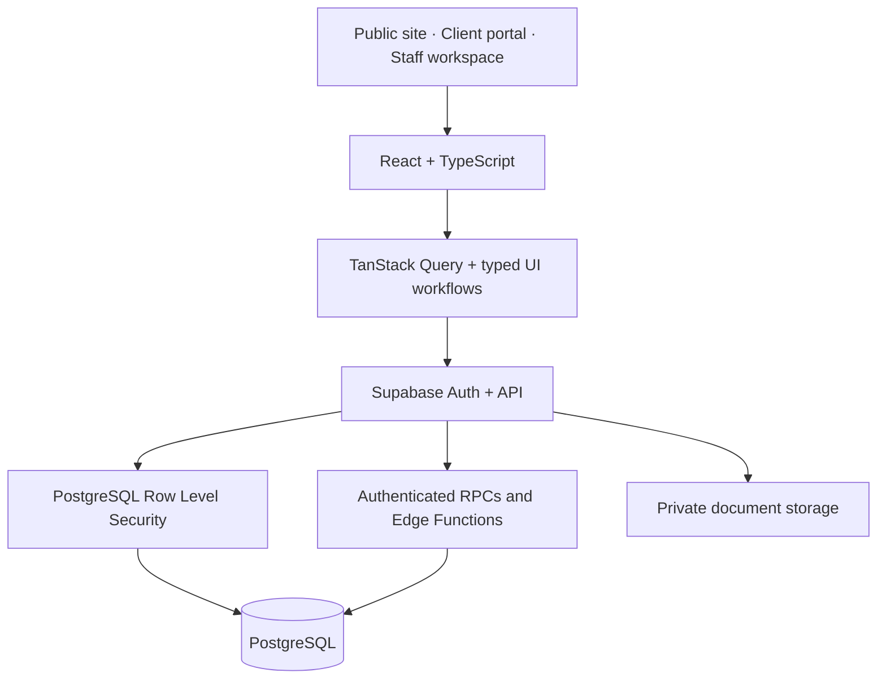

# C&B Gestión Laguna — Advisory Operations Platform

**A real business application connecting client requests, document workflows and the daily work of a tax and accounting advisory firm.**

| | |
| --- | --- |
| **Project** | C&B Gestión Laguna — Tenerife, Spain |
| **My role** | Freelance software developer; frontend-focused with full-stack application ownership |
| **Type** | Commercial client project; implementation repository private |
| **Stage** | Active development and controlled-pilot preparation (October 2026) |
| **Stack** | React 18, TypeScript, Vite, Tailwind CSS, Supabase, PostgreSQL |

> **Confidentiality:** This is a client-authorized, high-level engineering case study. It does not publish source code, customer records, tax identifiers, internal documents, access credentials or confidential operational details. Screenshots will only be added after a separate review using approved synthetic data.

## The business problem

An advisory firm coordinates deadlines, client requests, documents and staff responsibilities across multiple channels. When information is dispersed between email, messages, specialist software and individual staff members, it is difficult to answer the most important operational questions:

- What needs attention today, and who owns the next action?
- Which client must provide information before work can move forward?
- What is approaching a deadline or requires an exception?
- What was requested, submitted, reviewed or completed?

The product provides an **operational coordination layer** around existing accounting workflows, rather than attempting to replace specialist accounting software.

## My contribution — one system, three experiences

**1. Public business website.** Service information, resources and client-acquisition tools.

**2. Authenticated client portal.** Multi-company navigation, private document access, requested uploads, client procedures and progress history.

**3. Internal staff workspace.** A work-oriented interface for client portfolios, responsibilities, active requests, documents, deadlines, conversations and operational oversight.

A central frontend design decision is to show different users the work that matters to them without treating the UI as the source of authorization truth. Staff workflows separate **personal action queues** from **management-level exceptions**.

## Architecture

| Layer | Implementation |
| --- | --- |
| **Frontend** | React 18, TypeScript, Vite, React Router, Tailwind CSS, Radix UI, shadcn/ui |
| **Data and validation** | TanStack Query, React Hook Form, Zod |
| **Backend and persistence** | Supabase Auth, PostgreSQL, Storage, Edge Functions, RPCs |
| **Access control** | Tenant membership, role-based access control, explicit staff capabilities, Row Level Security |
| **Quality and delivery** | Vitest, React Testing Library, local Supabase integration tests, Playwright tooling, GitHub Actions, Vercel |

## Four engineering decisions

### 1. Tenant boundaries belong in the database

A portal user may be a member of more than one client organization. Switching the selected company changes the UX context; it must **not** grant access to another organization's data. Client memberships and PostgreSQL **Row Level Security (RLS)** establish the authorization boundary independently of the route or interface.

**Trade-off:** More careful database modeling and integration tests, in exchange for more reliable isolation than frontend-only checks.

### 2. Separate system roles from operational responsibility

The staff model includes `admin`, `advisor` and `junior` roles. Selected responsibilities use separate capabilities, including `can_manage_clients` and `can_resolve_client_requests`.

**Why:** A user may administer the system without being responsible for resolving client work; authorization should reflect that distinction instead of accumulating special-case checks based on role names.

### 3. Treat procedures as validated workflows

Client requests, required documents and reviews have explicit states and server-side transitions. The frontend helps people understand what they can do next, while controlled database operations validate sensitive changes and record activity.

**Why:** Business rules must remain consistent even when a client retries a request or bypasses the visible interface.

### 4. Design the staff workspace around actionable work

A personal dashboard prioritizes owned work, unassigned responsibilities, waiting-on-client items and deadlines. Management views emphasize exceptions and workload visibility. This is product architecture as much as frontend architecture: navigation and data presentation follow the team's actual responsibilities.

## Verification approach

The private repository contains frontend unit/component tests, database-focused tests and a local Supabase integration test runner for workflows and authorization. GitHub Actions and browser-testing tooling are also configured.

**Current status:** The application is being prepared for a controlled pilot. The presence of tests and CI does not imply complete coverage or a continuously passing production release gate. I do **not** claim a completed rollout, independently verified security certification, production uptime, adoption numbers or measured productivity gains.

## What this project demonstrates

- Taking a real operational problem through product modeling, frontend implementation and data-access design.
- Building separate interfaces for clients, staff and the general public around shared business workflows.
- Evaluating security beyond visible UI controls, including multi-tenant authorization and sensitive write boundaries.
- Coordinating complex states, responsibilities, deadlines and document flows.
- Maintaining a codebase with repeatable verification, technical documentation and explicit engineering trade-offs.

## Privacy, access and next steps

The implementation repository remains **private**. This public document describes the work at an engineering level; it does **not** provide access to private code, real client accounts or internal staff workflows. Any future screenshots will be reviewed for real names, identifiers, messages, documents, URLs and other sensitive content before publication.

For technical interviews, I can walk through the problem, architecture, authorization decisions and representative workflows without revealing confidential implementation details.

---

[← Back to my GitHub profile](https://github.com/Maria79)
